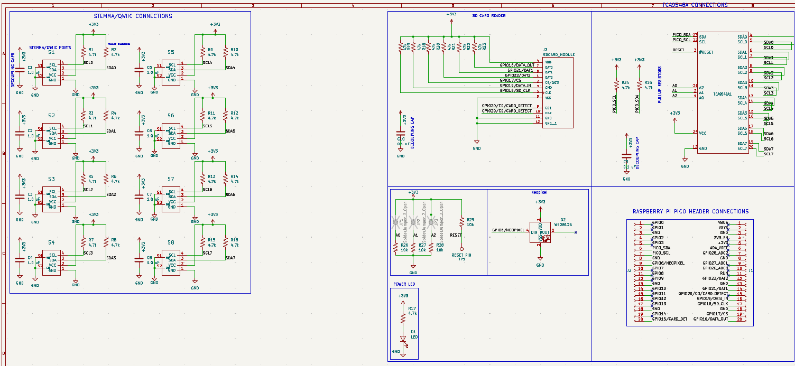

My reasoning and process for designing my [first custom PCB](https://github.com/ARM508W/Pico-I2C-MUX-Breakout-Board/tree/main) for the Raspberry Pico microcontroller with KiCAD

## Reasoning

For certain components in my capstone project, I would need to be able to detect whenever an object was taken off the desk display. After looking at some of the possible methods, the method I ended up settling on was using magnets for the detecting method. The way it would work was by having a magnet sensor in the back of the desk with a magnet on the other side of it. I would then also attach a magnet on the object, so when the object's magnet connected to the desk magnet, the magnet sensor behind it would sense the change and could shift the desks theme to correspond with the object. Using this method for detection allowed for wireless and more seamless methods for quickly switching between object themes.

Initially, to test out this method, I used one TLV493D magnetometer from Adafruit and the RP2040 QT PY board, which had a STEMMA QT port. This was to just test the feasibility of this method so all the microcontroller was programmed to do was to turn on its LED to green whenever a magnet was close by. After this test was performed, I decided this method would work and started to look into what would be needed to scale this up for the capstone project.

While this method would work great for the capstone project, some issues quickly became apparent. The first was the limitations with the magnetometers I2C addressing capitalize. With I2C devices, you are able to connect as many of them into a microcontroller as you can, as long as they don't have the same address, which in this case for the magnetometer was 0x5E. Some I2C sensors support the ability to change the address by soldering a jumper. The TLV493D did not have this ability, and even if it did, it wouldn't scale up once we add more than the supported address changes.

## Solution Brainstorming

To start off, I checked the available multiplexer devices that Adafruit and Sparkfun had on their store to see if they could work for the project. What I was looking for was a nice and compact MCU that had multiplexer and WiFi capabilities. With these requirements, I wasn't going to find something like this, so I was going to see if the boards with STEMMA connectors would be compact enough with a microcontroller that supports WiFi, such as the FeatherS2.

Image from [Adafruit](https://learn.adafruit.com/assets/123212)

While this fixed the problem of connecting the magnetometers into the microcontroller, two issues arose from this design.

---

### Size
While the size of the multiplexer and microcontroller were small, when they were combined together, the footprint was unnecessarily big; the microcontroller would be connected to the multiplexer via the master STEMMA/QWIIC port, which meant the setup was either going to be long horizontally or vertically. Due to this increased size footprint, placing the magnetometers in the places I wanted to was very awkward or, at times, not possible. Another thing I needed to consider is how it would look if someone were to look at the back of the desk, which is where the microcontroller and multiplexer would be at. I didn't want the backside to look like a mess of wires and that reeks of 'simple prototype, will come up with a final design later' look.

---

### ESP32 VS RP2040
For this ubiquitous desk component of the project, I decided on using the Raspberry Pi Pico W as the standard microcontroller. The reason for this was due to the versatility and price of the Pico W; there wasn't a microcontroller that could do and connect to nearly anything with WiFi at the price of around $6. The obvious downsides of this versatile microcontroller is that it lacked the features that a board sold from Adafruit for example, a STEMMA port, built-in Neopixel, etc. This meant that if I wanted to use a Pico W as the board the communicates with the magnetometers, I would need to instead solder on wires to both the Pico W and multiplexer, which would even further increase the size footprint, and ruin the aesthetics in the backside of the desk. 

Another issue that arises from splitting the multiplexer microcontroller from the RP2040 is the slight variations on WiFi and MQTT connections. Instead of using the same setup for handling the connection to the WiFi and MQTT broker on the Pico Ws on the desk, I would need to maintain a separate version of the ESP32. Later down the line could become an issue for debugging problems with the connections to the MQTT, and especially the MQTT broker as I noticed they have little differences between how they receive and publish messages.

---

With these issues, I decided to look and research further into a possible solution or better alternative.

---

## Initial Research for Custom RPI Breakout Multiplexer PCB

This is when I started to explore the idea of creating a custom breakout PCB for the Pico W. This would be a serious undertaking, and possibly overshadowing the original project. So I started to research the benefits and possible issues/roadblocks I could run into if I go down this path.

### First PCB
I would be concepting, designing and testing my first ever PCB whilst a senior in high school. This would provide me some serious experience early on as I pursue a career in electrical engineering. The experience of having a circuit not just be a bunch of wires connected through a breadboard, but instead be a real circuit board has already been a dream of mine. This came with its obvious issues. Since this was my first PCB, there were going to be some learning-pains and roadblocks that I was going to run into. I also needed to keep in mind possible time-constraints, as I would the design to continue working on the project.

### Flexibility and Control
By creating my own custom PCB for the multiplexer, I could decide what design components I would want that other multiplexer boards had, and what parts I could scrap as I wouldn't need them for the project. This also gave me the ability to add components to the Raspberry Pico that it otherwise wouldn't have, such as a built-in Neopixel. This, however, meant that I would need to handle things that I previously didn't need to handle; it wasn't going to be plug and play as the already made multiplexers from Adafruit and SparkFun.

### Ascetics and Size Footprint
Having a custom PCB operating the magnetometers would be more impressive than using a bought board. This also allowed me to make the multiplexer more compact than the other two on the market as I could integrate the Pico W directly into the PCB, which is discussed later in the notebook in how I went about this.

### Conclusion of Research
After weighing the pros and cons, I decided to go ahead with creating the PCB design for a custom multiplexer design for the Raspberry Pico W.

---

## Initial PCB Design Concepting
Now that I had concluded that I was going to create the PCB, I needed to set out what I would want to include with this breakout multiplexer PCB design. This also meant looking at any of the other multiplexer boards out in the market, which were manufactured and sold by Adafruit and SparkFun. In the end of the research of both these multiplexer boards, I would want to only use one of these boards as reference for the future as to avoid conflicting practices/methods of using the multiplexer. In the end, this ended up being the multiplexer sold by Adafruit.

### Using the Raspberry Pi Pico as a Base
The multiplexer PCB that I will design will use the Raspberry Pi Pico W as a base. The reason for this is the previous reasons meantined of the Pico already being the standard board used in the project, but another reason is that it would allow me to the built-in WiFi capabilities of the Pico W. If I were to add my own RP2040 chip to the PCB, I would also need to add back in the missing WiFi capabilities in the PCB. By doing this, the price of this would be more than just using a Pico W. For these reasons, I settled on this method of the PCB being a breakout multiplexer board for Pico W.

### I2C Pinouts or STEMMA/QWIIC Connectors?
One design choice that I wanted to keep from the Adafruit multiplexer was the STEMMA QT connectors. Since this whole project's goal was to make it easier and lower the amount of spaghetti cables going around, using the STEMMA QT ports would be the best choice. 

One thing with the naming scheme of STEMMA QT ports. SparkFun has their own version of these connectors, QWIIC, that are nearly identical. The one difference they do share is the voltage they are designed to be used for; STEMMA QT is designed for 3.3V and 5V, while QWIIC is only designed for 3.3V. For the sake of remaining consistent, I will be referring to them as STEMMA/QWIIC ports since this whole PCB is most similar to the Adafruit one, but these ports are more like QWIIC variants.

### Extra Peripherals
The Raspberry Pi Pico is a pretty barebones microcontroller compared to the other boards on the market; That's mostly up by the cheap price of it. With this breakout board, I could expand some of the capabilities of the board that I thought it would benefit from. This led to adding two peripherals alongside the multiplexer. First was the SD card reader. The reason for adding an SD card reader was that a lot of the time with I2C sensors, you want to keep the history of the readings somewhere. While for my capstone project, I planned to store this data somewhere else via the WiFi and a MQTT broker, this SD card reader would allow the non-WiFi version of the Pico to store the I2C sensor data somewhere, and still allow me to store the sensor data somewhere if the WiFi connection were to ever get interrupted. 

The second addition was a Neopixel. This addition was just a simple QoL one, in case I ever needed something more than just the green LED that the Pico had, such as MQTT connection status indicator. 

### Notable Differences between other Multiplexer Boards
While this board shares the same connection method to connect to the I2C devices, that's where it mostly ends. 
The other multiplexer boards often have another STEMMA/QWIIC port, or pinouts, to connect a microcontroller to the breakout board. 
With the Pico being attached to the breakout board directly through being soldered or with headers, these were redundant and not needed. 
Another removal was the ability to level shift all the ports to 3V. Due to the Pico already being a 3.3V microcontroller, having the ability to level shift would have not been needed.

## Designing the PCB
Now that I have settled on what I want for the PCB, I could get to designing. 

### Software
First was the software I was going to use to design all the components for the PCB, schematic, symbols, footprints, and the actual board. 
I already knew I wasn't going to use software used by people in the industry, Altium and Eagle, due to their cost and most likely being overkill for this project.
That left me with the free and open-source alternatives out there, which there are many of. 

The one I landed on was KiCAD because it is probably the best open-source PCB design software right now, 
and it doesn't need to be connected to the internet to run, like EasyEDA.

After deciding on KiCAD, I needed to find a guide to learn KiCAD, which was weirdly hard for some reason; some guides seemed to assume that you have 
design a PCB before, or were vague in certain aspects that I wanted to know more about. I finally found a [YouTube playlist](https://youtube.com/playlist?list=PLUOaI24LpvQPls1Ru_qECJrENwzD7XImd&si=yMHCCwz1f_A8HfNq) that answered most of questions I had left
about PCB design and how to navigate the UI in KiCAD.

## First Schematic and PCB design
After starting to fully work on the PCB once Winter Break started, I had my first initial design for the PCB around the start of the year.
While I still considered it unfinished, it had all the core components I wanted from this board. 

---

### `Schematic`
There are three major parts for the schematic design
- TCA9548a multiplexer connections
- Raspberry Pi Pico W connections
- STEMMA/QWIIC ports connections

Amongst all these were the required components to allow them to work properly, pull up resistors, and decoupling capacitors.

The first image shows the TCA9548a multiplexer connections. This is the IC that provides the capabilities to the Pico W to connect to the multiple I2C
devices that are the same. The top left SDA and SCL pins are the main pins connected to the Pico W, and the other SDA and SCL pins are for the I2C devices that 
will be connected. The other components near the multiplexer are the power LED that would light up when the Pico W is powered. The other is a decoupling capacitor 
for it.

Some things to note, the pull up resistors needed for the all the SDA and SCL pins were moved to where the STEMMA/QWIIC ports are defined, which
lead to a problem down the line. The other thing is the address pins and the reset pin are X out. This was only for the initial concept and were later changed 
to be set to their default state, High or Low, and then changed again in the final revision.

The second image shows the Pico W connections to the PCB board. These connections are being made to headers that the Pico W can be placed into, or be soldered on directly.
The main pins being used for this first design are the SDA and SCL pins, 3.3V pin, and GND pins. Since the Pico W is acting as a donor board, it doesn't really provide
easy access to the pins not in use.

The third image shows the STEMMA/QWIIC ports that allow the I2C devices to be connected. These are all the necessary parts are placed, like 
the pull up resistors, and pullup capacitors.

This only shows one of the ports, this design is repeated 8 times in total for all the multiplexer SDA and SCL pins.
This component of the PCB is the one that remains mostly the same across iterations. 

---

### `PCB Design`
The PCB has the components talked about in the schematic and all placed in roughly where I want them. The board is a simple 2-layer board with a front and back 
GND layer. 

Now I want to bring some of the missing components previously talked about, such as the SD card reader and Neopixel. Since this was my first PCB design and the main 
focus of the board was still the multiplexer capabilities, I was fine with leaving the SD card reader and Neopixel out for now until I received confirmation that 
The multiplexer connections and overall board was done correctly. 

The first image shows the middle portion of the PCB, which is where the Pico W and TCA9548a would be placed. The reason both of these components can be placed 
underneath/above each other is because the Pico W would either be connected via the headers on the PCB, or soldered on directly to the headers of the Pico W. 
This allows it to have enough room between the two so it doesn't crush the TCA9548a.
The reason I wanted them both to be in the middle TCA9548a needing to have the easiest connection pathways to all the STEMMA/QWIIC ports, and for aesthetics purposes.
The gap between the two also addresses an issue with the WiFi being interrupted from the Pico W that could arise if the Pico W was soldered onto the PCB without the headers.

The traces from the TCA9548a are going between the pads and are mostly alright. Some of the rougher traces are fixed in the later revisions once 
all the components are added.

The second image shows the STEMMA/QWIIC ports that are off to the side of the board. They get their power from the 3.3V trace from the Pico W going around the edge of the board.
The SDA and SCL pins first go through the pull up resistors and then go to the TCA9548a multiplexer. 

Near the bottom, you can see that a GND via is needed since a GND island was created from the 3.3V trace. This was needed for all of the ports since their components are laid out the same, 
except mirrored from across the board.

---

That covers the parts I wanted to cover in the initial design.

---

## First Manufactured PCB design

With the first design having the multiplexer connection correctly setup, I moved to adding the SD card reader and Neopixel, while also tidying up the board.

---
### `Schematic`
The changes here are the addition of the SD card reader and Neopixel, which were omitted from the initial concept. 

The first image shows the connections are all being made to right side of the Pico W since the bottom right side was better fit for the SD card reader to be placed since of the 
placement of the traces in that section. This also includes all the necessary parts for it to run properly, decoupling capacitors and pull up resistors.

The second image shows the connections for the Neopixel. Nothing much of note here since the Neopixels already has a necessary resistor. The DOUT pin isn't being used here because 
it's only used for chaining Neopixels together.

The Neopixel I planned to use here was the 1.5mm Neopixel

Image from [Adafruit](https://www.adafruit.com/product/4492)

Some of the other changes made in the schematic were changing the address pins and reset pin on the TCA9548a to their default values. At that time, it didn't 
allow the ability to change them with jumpers pads.

There were also some changes to the layout of the schematic.

---

### `PCB`
The changes here are also the addition of the SD card and Neopixel components.

**Sorry, this when the PCB design starts to get cluttered**

The SD card reader is positioned in the right side of the board, with all of its pull up resistors being placed around the general area. 
It got a little close in some areas, like the resistors near the STEMMA/QWIC ports, but I think overall, the SD card reader fits in pretty nicely.

The second image shows the Neopixel placement and its traces. Just like the schematic, nothing really notable here since of the Neopixel generally being 
easy to integrate to a project.

Some of the other changes were adjusting the traces, and connecting the address pins and reset pin with trace to either high and low.

---

### Conclusion from First PCB Design 
After some more adjusting of the traces and positions of components, I started to get ready to send off the board to get manufactured.

The manufacturer that was used was called OshPark, located in the US. Originally, I had left the constraints of the board as default till I could figure out what 
manufacture would produce the PCB. So I adjusted the constraints and fixed any problems that came up when running the design rules checker.

Once it arrived and checked all was in order, it was obvious that I had made a mistake. 

The PCB lacked the necessary pads and connection for the TCA9548a SDA and SCL traces for the Pico W. When I moved all the pull up resistors for the STEMMA/WII Sports, 
I had forgotten to leave or add back in the pull up resistors for the TCA9548a main SDA and SCL lines. While there were ways to fix this, like using the 
internal pull up resistors on the Pico W, it wouldn't be nearly enough to maintain a consistent connection. 

While this sucked, **a lot**, I still decided to quickly solder on a Pico W to test out if the STEMMA/QWIIC ports could power a I2C devices and the other functions 
of the board. This ended up going well as the other parts of the board worked great. 

Now was the time to manufacture the last iteration of the PCB, this time with a working multiplexer.

---

## Final PCB Design
Now was the time to make all the changes with the PCB since seeing in-person for the final PCB design that I would end up using for my project.

---

### `Schematic`
The first change was the addition of the two missing pull up resistors for TCA9548a. 

After that, I went around and changed and added some parts/components that I had changed my mind on.

As shown in the second image, I had added jumpers for the address and reset pins on the TCA9548a, and changed the Neopixel.

The reason for adding jumpers was to just have them in case I ever needed them. After already needing to another PCB, from the pull up resistor incident, 
I really didn't want to reorder another PCB because I thought I would never need access to those pins. 

The second change from that image is the Neopixel. While the symbol doesn't really show much, in the PCB design, the Neopixel footprint is different since 
I had switched to wanting to use the 5mmx5mm Neopixel.

Across the schematic, I had adjusted some of the values for the resistors, like the power LED indicator.

---

### `PCB`
The main changes are, again, the addition of the missing pull up resistors, jumpers for the TCA9548a, and changing the Neopixel footprint.

The first image shows the missing pull up resistors at the bottom, and the new jumpers at the top. The way the jumpers work is by just adding some solder to the jumper 
placed in the back of the board. This bridges the gap and, in the address pins case, allows the TCA9548a to change its address, if you wanted to chain these together, **For some reason**.

The second image shows the new Neopixel footprint. Nothing other than that had changed with the Neopixel, but just allowed the colors to be more prominent. 

---

With that, I was ready to order the final PCB design.

**Final Schematic Design Sheet**

**Final PCB Design**

---

## Assembling the PCB
When ordering from OshPark, you automatically get 3 of your PCB designs. That's why I one was for the project, one was going to be assembled but for display, 
and one wasn't going to be assembled and also used for display. This all of course hinged on the fact that nothing went wrong when soldering the PCB.

The method that was going to be used to solder these boards was by using a reflow-oven. This method was way faster, **and cooler**, then just soldering it by hand.
That's why a stencil for the PCB was also ordered. This would allow solder paste to be easily applied to the board.

As soon as the PCBs and stencil arrived, the process to assemble them started!

*>*]:my-0">

After everything was done and tested to make sure it worked, this was the final product.

---

## Conclusion of PCB Design Journey
This started as initially a component of my capstone project, but quickly outgrew it. 

I thought I would have to wait till college before I could turn my breadboard designs into real PCBs, but I was able to create one as a High School student.
This has opened a lot of doors for me as I am no longer restricted to what's in the market; I can design and manufacture breakout boards that I need for 
projects, or maybe eventually my own custom microcontroller. 

This notebook is already too long, so the next notebook will talk about the code that runs the TCA9548a multiplexer with the Pico W.

The [GitHub repo for the PCB](https://github.com/ARM508W/Pico-I2C-MUX-Breakout-Board/tree/main) contains all the steps to create your own version, with all the KiCAD files.

This wouldn't have been possible without my teacher, Ms. West, for providing me with all the necessary materials and support for me to complete this project. Thank you! 🤍

